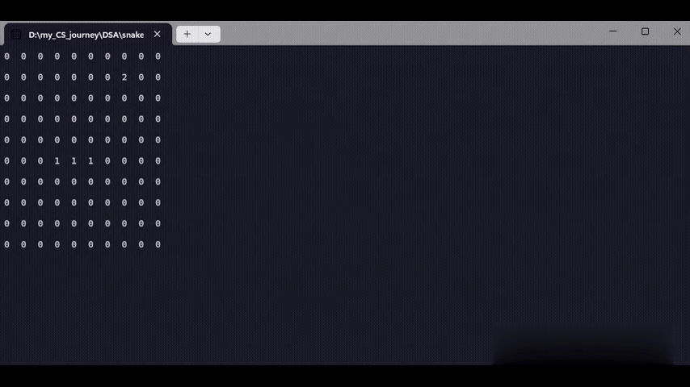

# Snake Game 1

A console-based implementation of the classic Snake game built using C++ and STL containers.

## Demo

## Features

* Grid-based gameplay
* Random food generation
* Dynamic snake growth
* Real-time movement
* Self-collision detection
* Wall collision detection
* Console rendering

## Technologies Used

* C++
* STL (`vector`, `pair`)
* 2D Matrix Representation
* Console Programming

## Implementation Details

* The game world is represented using a 2D matrix.
* `0` represents an empty cell.
* `1` represents a snake segment.
* `2` represents food.
* Snake segments are stored using a vector of coordinate pairs.
* Food is generated at random valid positions on the board.
* Collision detection handles walls and snake body intersections.

## What I Learned

* Working with 2D arrays and matrices
* Grid-based game logic
* Dynamic data structures using STL vectors
* Collision detection
* Game state management
* Basic game loop implementation

## Project Progression

This project is the first stage in my Snake game series:

1. Snake Game 1 — Console Version
2. Snake Game 2 — SFML Graphics Version
3. Snake Game 3 — Raylib 3D Version with a BFS-powered AI opponent

## License

This project is open source and available under the MIT License.
